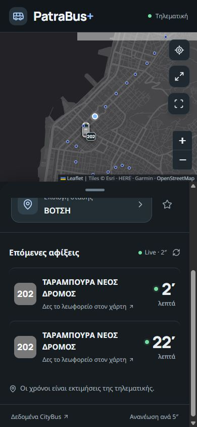
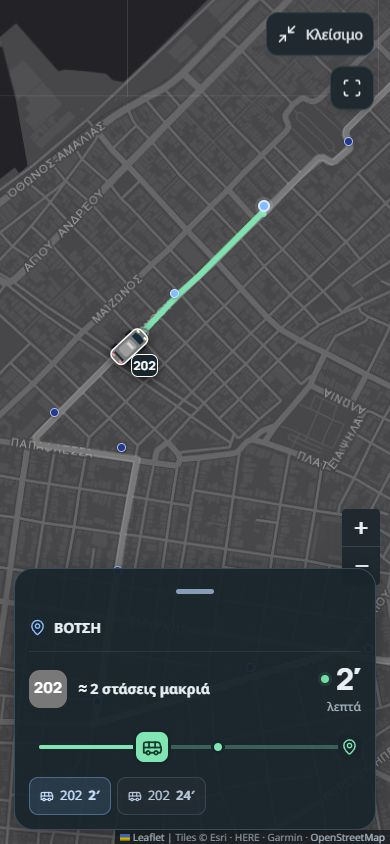
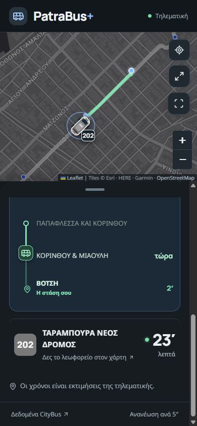

# PatraBus+

A mobile-first, unofficial live bus tracker for Patras, Greece. [Open the app](https://patrabus.vercel.app/) · [Original CityBus telematics](https://patra.citybus.gr/el/stops)

## Why I built it

The original tracking site provides useful bus data, but the experience was frustrating on a phone: it felt slow, the layout was hard to navigate, live updates seemed infrequent, and mobile sessions sometimes lagged or crashed. PatraBus+ redesigns the rider-facing experience around one question: **where is my bus, and when will it reach my stop?** It uses the same CityBus data source rather than running its own tracking system.

## Mobile views

| Live arrivals | Full-screen map | Bus approaching a stop |
| --- | --- | --- |
|  |  |  |

## What changed

- **A clearer mobile flow.** Pick a line, direction, and stop; save frequent stops as favorites; expand the map or collapse it to focus on arrivals.
- **More responsive live tracking.** The selected stop refreshes every five seconds. Bus markers move smoothly along the published route between GPS samples instead of jumping across the map. The movement is visual interpolation, not a claim of new GPS data.
- **Arrival context.** Live ETAs, route colors, a bus-to-stop path, and the remaining stops appear together. When CityBus provides an ETA for the same vehicle at an earlier stop, that estimate appears in the vertical approach list.
- **A useful fallback.** When live arrivals are unavailable, the app can show stop-specific published times for trips in the next 45 minutes. The full timetable has a date picker and line filter. Scheduled times are labeled separately from live data.
- **An iPhone-friendly interface.** Large touch targets, a draggable map panel, safe-area layout, a dark map, and a home-screen icon make the web app feel at home on mobile.

## How it works

The React interface uses Leaflet for the map and local stop/line snapshots for fast selection. A server-side `/api/bus` route requests live arrivals, route geometry, stop order, and published timetables from the endpoints used by the CityBus site. It keeps the access token on the server and caches live responses briefly. The browser never needs the token.

Arrival times come from CityBus. PatraBus+ counts down between responses and uses GPS plus route geometry to show progress; it does not have independent traffic, occupancy, or vehicle telemetry. If a position or per-stop ETA is missing, the interface avoids presenting it as live.

## Run locally

Requires Node.js 22.13 or newer.

```bash
npm install
npm run dev -- --hostname 0.0.0.0 --port 3000
```

Open `http://localhost:3000`. A phone on the same network can use your computer's local IP address on port 3000.

```bash
npm run build:vercel  # Next.js build used on Vercel
npm run build         # Vinext build used by the original local/Sites setup
```

The Vercel deployment uses the configuration in [`vercel.json`](vercel.json). The server route needs outbound access to `patra.citybus.gr` and `rest.citybus.gr`.

## Data and attribution

PatraBus+ is an independent interface and is **not affiliated with Astiko KTEL Patron or CityBus**. Bus locations, arrival estimates, routes, and schedules originate from [CityBus](https://patra.citybus.gr/el/stops); the map displays its tile-provider attribution in the app. CityBus endpoints and availability can change, so this project does not promise an uninterrupted feed. Always allow extra time for travel.
